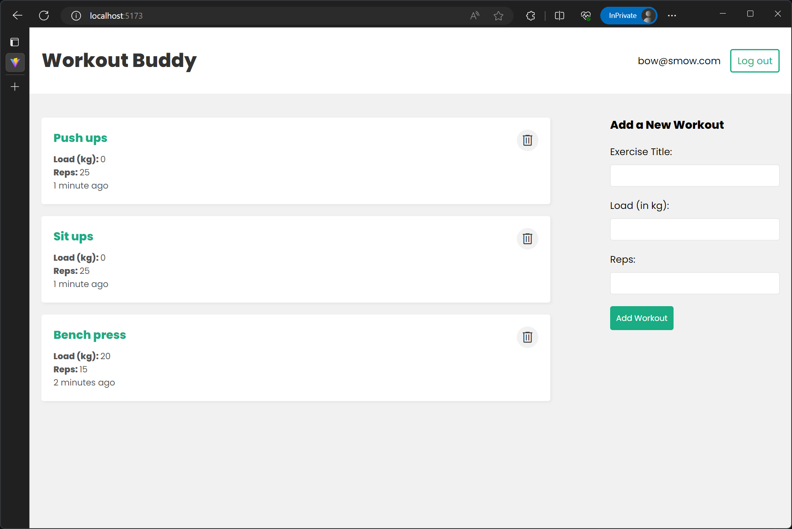

# Workout Buddy (Frontend)



A React frontend for a workout tracker with authentication. This project depends
on an [Express backend project][backend-url].

## Running the project locally

1. Clone and setup the [backend project][backend-url] by following its README.

   Note: If you modified the `PORT` environment variable to something other than
   4000 in the backend project, modify the `VITE_API_URL` in the `.env` file so
   that the port in the API URL matches.

2. Clone this project and install dependencies.
   ```bash
   git clone https://github.com/srijan-nayak/workout-buddy-frontend.git
   cd workout-buddy-frontend
   npm install
   ```
3. Make sure the backend server is running, then start the dev server for this
   project.
   ```bash
   npm run dev
   ```
   Once the dev server is running, you can visit the address shown in the
   terminal in a browser to use the application.

[backend-url]: https://github.com/srijan-nayak/workout-buddy-backend "GitHub URL for backend project"
